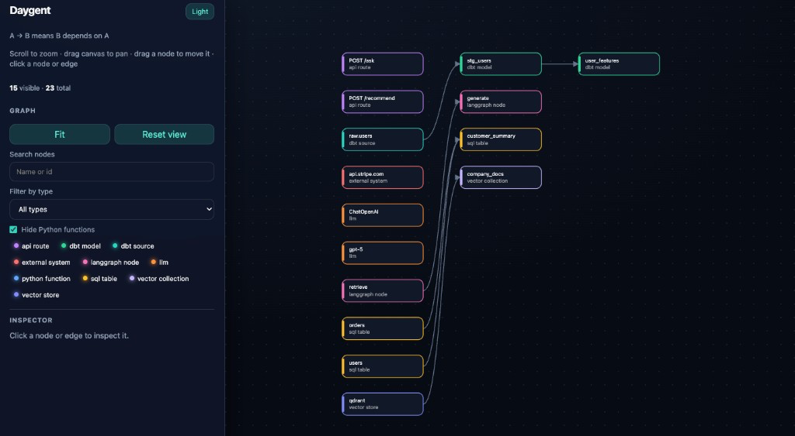

# Daygent

Local-first static lineage and blast-radius analysis for modern data + AI repositories.

Daygent reads source files on disk and builds a dependency graph you can inspect, query, and share as JSON, Mermaid, or a fully offline HTML viewer. It answers questions like:

- What depends on this table or dbt model?
- Which API routes could change if this function changes?
- What is downstream of this dataset?
- Which agents, LLMs, or vector collections sit on this path?

It does **not** connect to warehouses, APIs, vector databases, or cloud accounts. It does **not** execute scanned code, resolve environment variables, or phone home.

## Interactive graph viewer

<p align="center">
  
</p>

Explore dependencies visually, inspect nodes and edges, filter by technology, and trace upstream/downstream impact — fully offline.

```bash
daygent scan .
daygent graph --html --open
```

## Why it exists

Data + AI codebases mix SQL, dbt, Python services, FastAPI, LangGraph, LLM constructors, and HTTP clients. Runtime catalogs and vendor consoles only see what already ran. Daygent maps what the **source** statically declares, so you can review impact before you ship.

## How it works

```text
Repository
   ↓
Scanner (walk files, skip junk)
   ↓
Technology parsers (all matching parsers run)
   ↓
Candidate graph
   ↓
Relevance scope  ←  scan broadly, graph narrowly
   ↓
.daygent/graph.json
   ↓
daygent graph  |  daygent impact  |  HTML viewer
```

Parsers may see every function in a file. The final graph keeps **data/AI lineage**: tables, dbt models, LLMs, vector stores, HTTP hosts, LangGraph nodes, and the connector code that joins them. Unrelated helpers such as `format_date()` stay out unless they sit on that lineage.

## Graph convention

**A → B means B depends on A.** Impact walks with the arrows. Upstream lineage walks against them.

```text
raw.users
   ↓
stg_users
   ↓
user_features
```

Changing `raw.users` can affect everything below it.

## Supported technologies

Static detection only:

| Area | What Daygent reads |
| --- | --- |
| Python | modules, functions, local calls, imports |
| SQL | table lineage via sqlglot, including CTEs |
| dbt | `ref()` / `source()` from Jinja SQL (no dbt CLI, manifest optional) |
| FastAPI | routes, handlers, `include_router` |
| LangGraph | literal `add_node` / `add_edge` |
| LLM constructors | ChatOpenAI, Anthropic, Azure, … when the model is a literal |
| Embeddings | OpenAI / HuggingFace / SentenceTransformer constructors |
| Vector stores | Qdrant, Pinecone, Weaviate, Chroma, FAISS, PGVector |
| External HTTP | literal `https://host/...` URLs |
| PySpark | table reads/writes (`spark.table`, `read.table`, `saveAsTable`, `writeTo`) and literal `spark.sql` |
| Databricks DLT / Lakeflow | pipeline declarations (`@dlt.table`, `@dp.materialized_view`, `dlt.read`, …) |
| Embedded SQL in Python | literal SQL in `execute` / `text(...)` style calls |
| pandas | literal `read_sql` / `read_sql_query` / `read_sql_table` |
| Django | basic ORM model lineage, `objects.raw`, explicit `Meta.db_table` |
| SQLAlchemy | basic model/table lineage, `select`/`query`, literal `text()`, explicit `__tablename__` |

No live vendor, database, Spark session, Django setup, SQLAlchemy engine, or network calls. Dynamic names (`os.getenv("TABLE")`, f-strings, `spark.sql(query)`) are **not** resolved.

## Install

Requires Python 3.11+.

```bash
pip install daygent
```

With uv:

```bash
uv tool install daygent
```

One-off:

```bash
uvx daygent --help
```

## Quick Start

```bash
daygent scan .
daygent graph --html --open
daygent impact <node>
```

From a clone (contributors):

```bash
git clone https://github.com/emyrael/daygent.git
cd daygent
python3.11 -m venv .venv
source .venv/bin/activate   # Windows: .venv\Scripts\activate
pip install -e ".[dev]"
```

## Commands

```bash
daygent scan .
daygent graph
daygent graph --json
daygent graph --mermaid
daygent graph --html --open
daygent impact <node>
```

`scan` writes `.daygent/graph.json` (gitignored). `graph` and `impact` read that artifact. If it is missing, the CLI tells you to scan first.

Useful flags:

```bash
daygent scan . --verbose
daygent graph --html --include-source --open
daygent impact stg_users --depth 2 --json
```

`--include-source` is opt-in. Default HTML never embeds repository file contents. With the flag, the viewer includes a short excerpt around known lines and banners: *This HTML contains source-code excerpts.*

## Config is optional

No `daygent.yml` is required. Empty or missing `include` means repository-wide discovery, then lineage scoping.

```yaml
# daygent.yml — optional overrides only
exclude:
  - migrations/**
  - generated/**
output: .daygent/graph.json
```

Built-in skips include `.venv`, `node_modules`, `graphify-out`, `.cursor`, and `*.egg-info`.

## HTML viewer

`daygent graph --html --open` writes a self-contained `.daygent/graph.html`:

- opens on **asset lineage**: tables, dbt models, pipeline datasets, routes, and vector stores, with Python functions and temp views contracted into single edges
- **Show implementation details** reveals the full detailed graph; nothing is ever deleted from it
- connected pipelines are laid out left to right and packed into rows, so unrelated flows sit side by side instead of stacking into one tall column
- filtering by one or more types keeps the matching nodes **plus their lineage neighbours** (switch to `Show matches only` for the strict view)
- **Focus lineage** reduces the canvas to the selected node's connected flow
- search centers the first match and keeps its context; Enter cycles matches
- clicking a contracted edge lists the hops it hides, e.g. `via load_orders() → tmp_orders → clean_orders()`
- `bronze.*` / `silver.*` / `gold.*` appear as grouping labels only where the name actually contains them; they never create edges
- no CDN, no `fetch`, no telemetry

## Local-first guarantees

- Fully offline after install
- No telemetry
- No runtime network calls from Daygent itself
- No warehouse / vector-store / API credentials
- No secret or environment resolution
- Scan warnings do not print file bodies

## Cross-stack lineage

Daygent statically connects lineage across SQL, dbt, PySpark, Databricks DLT/Lakeflow, Python data access, Django/SQLAlchemy, AI/vector infrastructure, LangGraph, and FastAPI where dependencies can be resolved from source. A change to an `app.requests` dbt source can reach a FastAPI route through hops such as:

```text
app.requests → raw_data_request → subscription_info → gold_subscription_metrics
  → v_subscription_metrics → silver.subscription_features → gold.customer_360
  → app.subscription_snapshot → load_subscription_documents() → build_subscription_index()
  → subscription_rag → retrieve → generate → POST /ask
```

Those hops do not require imports across data boundaries. The dbt layer does not need to import the pipeline and the pipeline does not need to import the Django app; Daygent reconciles asset identity across the repository, so the `gold_subscription_metrics` written by dbt and the one read by `spark.read.table(...)` are a single node.

## Known limitations (v0.2)

- Spark temp views resolve within the declaring module only. A view created in one file and consumed in another is not linked.
- Asset identity merges only on provable evidence: a dbt manifest relation, an exact qualified relation name, or a unique unqualified dbt model name. A schema-qualified table never collapses onto a bare model with the same basename, so genuinely ambiguous names stay separate nodes.
- Arbitrary runtime reflection is unsupported: `getattr`, dynamic imports, monkeypatching, and dependency injection do not produce edges.
- Full symbolic DataFrame propagation is not attempted; only deterministic same-function assignment forms are tracked.
- Dynamic table names, f-string SQL, and runtime-constructed queries are generally omitted.
- Loop unrolling covers literal `dict`/`list`/`tuple` constants with `.items()`, `.keys()`, `.values()`, or direct iteration, up to 64 entries. Anything computed at runtime is skipped.
- DataFrame dataflow is same-function and assignment-level: `df = spark.read.table(...)`, `df = df.transform(...)`, `df.write...`, `df.createOrReplaceTempView(...)`. There is no symbolic execution.
- Cross-file Python calls resolve only through static imports. Dynamic dispatch, class instantiation, and attribute chains deeper than one level are not resolved.
- If a name is both a logical `@dlt.view` and a genuinely physical table elsewhere, the logical declaration wins and the two collapse into one node.
- No Spark plan analysis, Databricks workspace inspection, Django setup/import, or SQLAlchemy metadata reflection.
- Isolated Python helpers and unrelated health routes are omitted by design (scoping).
- dbt compile and warehouse introspection are out of scope.
- Default HTML does not ship source code.

The golden fixtures at `tests/fixtures/golden_mixed_stack/`, `tests/fixtures/python_data_stack/`, and `tests/fixtures/dlt_sensor_pipeline/` lock this behavior.

## Roadmap

- Real-repository testing beyond fixtures

## License

MIT. See [LICENSE](LICENSE).

## Contribute

See [CONTRIBUTING.md](CONTRIBUTING.md) for setup, parser contracts, and test rules.
